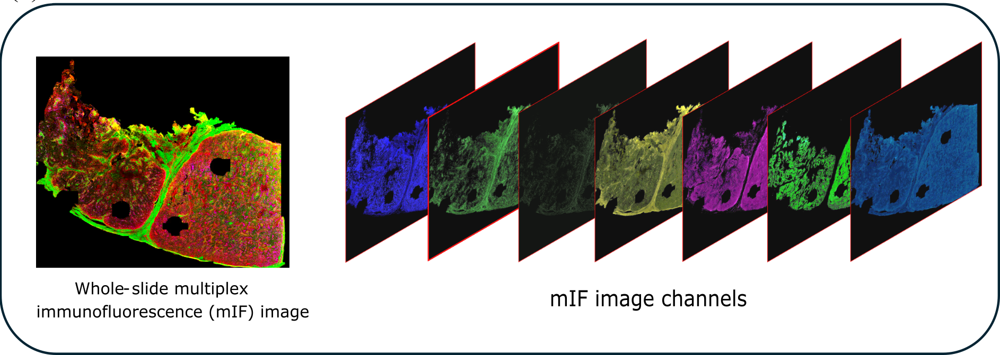
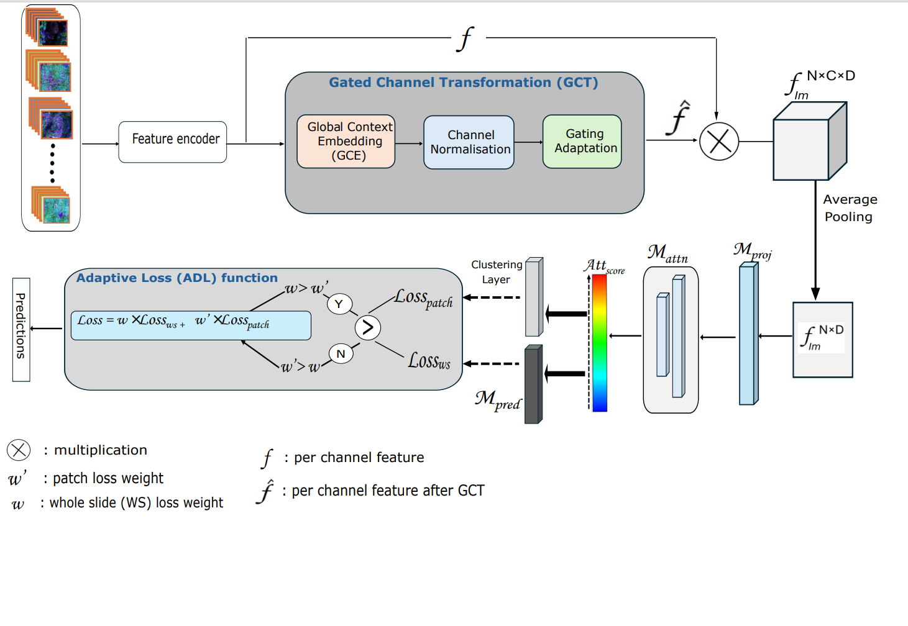

<h1 align="center">COMIL: <strong>C</strong>hannel <strong>O</strong>ptimisation with <strong>M</strong>ulti-<strong>I</strong>nstance <strong>L</strong>earning</h1>


<p align="center">
<a href="https://ieeexplore.ieee.org/stamp/stamp.jsp?tp=&arnumber=11265862">📄 Paper</a>
</p>

<p align="center"><strong>Deep Learning Framework for Classifying Whole-slide Multiplex Immunofluorescence Images to Predict Immunotherapy Response in Melanoma Patients</strong></p>

<p align="center"><em>Journal of Biomedical and Health Informatics (JBHI), 2025</em></p>

<p align="center"><em>Priyanka Rana, Tuba N Gide, Nurudeen A Adegoke, Yizhe Mao, Shlomo Berkovsky, Enrico Coiera, James S Wilmott, Sidong Liu</em></p>


<p align="center">
 Whole-slide multiplex immunofluorescence (mIF) images enable detailed analysis of cells/tissues in their microenvironment, deepening insights into disease
mechanisms. However, numerous channels, an extensive image size, and spatially dispersed information of mIF
images pose analytical challenges, requiring advanced techniques to effectively learn these intricate features for
optimal performance. In this study, we introduce a novel deep-learning framework, Channel Optimisation with MultiInstance Learning (COMIL), specifically designed to classify whole-slide mIF images for predicting immunotherapy response in melanoma patients. The study demonstrates that a feature extraction method that models interchannel relationships and captures complex interdependencies among multiple channels of mIF images enhances
classification performance. Additionally, incorporating this method within an MIL framework, optimised at both the slide and instance levels, further improves the classification performance of whole-slide mIF images

COMIL models inter-channel relationships to capture complex dependencies across biomarkers in multiplex immunofluorescence (mIF) images. It enhances slide- and instance-level MIL for whole-slide mIF classification in immunotherapy response prediction.

<p align="center">
  
</p>


## Method Overview
<p align="center">
  
</p>


## COMIL: Multi-Instance Learning with GCT + ADL

**COMIL** is a Multi-Instance Learning (MIL) framework that integrates:

- **GCT — Gated Channel Transformation**
- **ADL — Adaptive Dual Loss**

Designed for datasets where each patch contains multiple biomarker channels:

- **Biomarkers:** CD8, CD68, CD16, PD-L1, etc.
- **DAPI:** Nuclear stain
- **AF:** Autofluorescence

COMIL expects bags shaped:[N_patches, C_channels, D_features]
Example: [N, 7, 2048]

---

### 🔹 GCT (Gated Channel Transformation)

Reusable channel-attention module:

```python
from comil import GCT

x = self.gct(x)   # x: [N, C, D]
🔹 ADL (Adaptive Dual Loss)

Balances bag-level and instance-level MIL losses:
bag_loss = loss_fn(logits, label)
instance_loss = instance_dict['instance_loss']

if bag_loss > instance_loss:
    total_loss = args.bag_weight * bag_loss + (1 - args.bag_weight) * instance_loss
else:
    total_loss = args.bag_weight * instance_loss + (1 - args.bag_weight) * bag_loss
Drop this into any MIL training loop (CLAM, ABMIL, DSMIL, custom MIL, etc.).

🔹 Using COMIL in Your Pipeline:
from comil import COMIL

model = COMIL(
    n_classes=2,
    size_arg="small",
    gate=True,
    dropout=True,
    k_sample=8
)
🔹 Patch-Level Multi-Channel Features:
patch_features = torch.stack([
    biomarker_feat1,   # 2048-D
    biomarker_feat2,   # 2048-D
    ...
    biomarker_featN,   # 2048-D
    dapi_feat,         # 2048-D
    af_feat            # 2048-D
], dim=0)              # → [C_channels, 2048]


