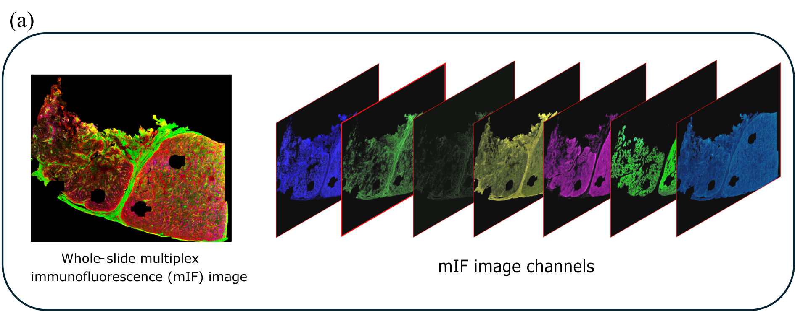

# COMIL
COMIL (Channel Optimisation with Multi-Instance Learning) models inter-channel relationships to capture complex biomarker dependencies. By incorporating an MIL framework optimised at both slide and instance levels, it enhances the classification performance of whole-slide mIF images for immunotherapy response prediction. 

[Paper Title](https://ieeexplore.ieee.org/stamp/stamp.jsp?tp=&arnumber=11265862)
#Deep Learning Framework for Classifying Whole-slide Multiplex Immunofluorescence Images to Predict Immunotherapy Response in Melanoma Patients
Journal of Biomedical and Health Informatics (JBHI), 2025.
*Priyanka Rana, Tuba N Gide, Nurudeen A Adegoke, Yizhe Mao, Shlomo Berkovsky, Enrico Coiera, James S Wilmott, Sidong Liu*
| [Paper](https://ieeexplore.ieee.org/stamp/stamp.jsp?tp=&arnumber=11265862) |

## Abstract
Immunotherapy has emerged as a prominent approach in melanoma treatment, however a substantial number of patients do not respond effectively.
This highlights the critical need to accurately predict immunotherapy responses for designing personalised treatment strategies. Current practices rely predominantly on
clinical data and the expertise of oncologists; however, a
deeper understanding of molecular interactions through
tissue-based biomarkers offers a promising avenue for
advancement. Whole-slide multiplex immunofluorescence
(mIF) images enable detailed analysis of cells/tissues in
their microenvironment, deepening insights into disease
mechanisms. However, numerous channels, an extensive
image size, and spatially dispersed information of mIF
images pose analytical challenges, requiring advanced
techniques to effectively learn these intricate features for
optimal performance. In this study, we introduce a novel
deep-learning framework, Channel Optimisation with MultiInstance Learning (COMIL), specifically designed to classify whole-slide mIF images for predicting immunotherapy response in melanoma patients. The study demonstrates that a feature extraction method that models interchannel relationships and captures complex interdependencies among multiple channels of mIF images enhances
classification performance. Additionally, incorporating this
method within an MIL framework, optimised at both the
slide and instance levels, further improves the classification performance of whole-slide mIF images

## Method Overview
Describe your method here...

